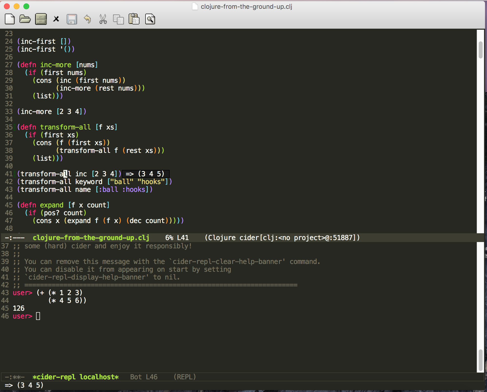

## What is this?

This is my personal emacs configuration on MAC OSX, it's mainly configured for writing and running Julia and Clojure.

## Themes

Monokai

**Julia mode**

**Clojure mode**

## Functions

* Basic setting up, e.g., show line number, set font and appearance
* Save all backup files in the specified path `~/.emacs.d/emacs-backup`
* Set TAB as completion (default M-TAB)
* Electrical auto indent
* Highlight matching parentheses
* Copy exectutable path from shell (copy environment variables from `~/.zshrc`)
* Auto completion (trigger ac only when pressing TAB)
* Colorize delimiters (essential for elegantly writing Clojure or any other Lisp-like language)
* Julia mode (enable latex substitute with TAB)
* Clojure mode, Racket mode
